# DIAGRAMMES UML COMPLETS — PANDA (PANDA)
### Projet de Fin d'Études — Ayoub Elmernissi — 2025/2026

> **Comment utiliser ces diagrammes :**
> Copiez chaque bloc `@startuml ... @enduml` sur **[plantuml.com/plantuml](https://www.plantuml.com/plantuml/uml/)**
> ou utilisez l'extension **PlantUML** dans VS Code (Ctrl+Shift+P → "Preview Current Diagram")

---

## TABLE DES MATIÈRES

| # | Diagramme | Type |
|---|-----------|------|
| 1 | Diagramme des cas d'utilisation — Vue globale | Use Case |
| 2 | Diagramme des cas d'utilisation — Freelancer | Use Case |
| 3 | Diagramme des cas d'utilisation — Client | Use Case |
| 4 | Diagramme des cas d'utilisation — Admin | Use Case |
| 5 | Diagramme de classes complet | Class |
| 6 | Diagramme Entité-Relation (ERD) | ERD |
| 7 | Séquence — Inscription & Onboarding Freelancer | Sequence |
| 8 | Séquence — Connexion Google OAuth | Sequence |
| 9 | Séquence — Publication d'offre et soumission de proposition | Sequence |
| 10 | Séquence — Acceptation de proposition & création de contrat | Sequence |
| 11 | Séquence — Paiement Escrow complet | Sequence |
| 12 | Séquence — Génération de proposition par IA | Sequence |
| 13 | Séquence — Messagerie temps réel | Sequence |
| 14 | Diagramme d'activité — Cycle de vie d'une mission | Activity |
| 15 | Diagramme d'activité — Flux de paiement Escrow | Activity |
| 16 | Diagramme d'état — États d'une offre (JobPosting) | State |
| 17 | Diagramme d'état — États d'une proposition | State |
| 18 | Diagramme d'état — États d'un contrat | State |
| 19 | Diagramme d'état — États d'un jalon (Milestone) | State |
| 20 | Diagramme de déploiement | Deployment |
| 21 | Diagramme de composants | Component |

---

## 1. CAS D'UTILISATION — VUE GLOBALE

```plantuml
@startuml UC01_GlobalPanda
left to right direction
skinparam actorStyle awesome
skinparam packageStyle rectangle
skinparam backgroundColor #FAFAFA
skinparam usecase {
  BackgroundColor #E8F4FD
  BorderColor #2196F3
  ArrowColor #2196F3
}

title Diagramme des Cas d'Utilisation — Panda (Vue Globale)

actor "Freelancer" as FL #LightGreen
actor "Client"     as CL #LightBlue
actor "Admin"      as ADM #LightCoral

actor "Google\nOAuth" as GOOGLE <<external>> #LightYellow
actor "Ollama\nMistral" as AI <<external>> #Lavender
actor "Stripe" as STRIPE <<external>> #Wheat

rectangle "Panda — Marketplace Freelance" {

  package "Authentification" #F0F8FF {
    usecase "S'inscrire" as REG
    usecase "Se connecter" as LOGIN
    usecase "OAuth Google" as GOAUTH
    usecase "Onboarding" as ONBOARD
    usecase "Se déconnecter" as LOGOUT
  }

  package "Gestion des Offres" #F0FFF0 {
    usecase "Publier une offre" as POST_JOB
    usecase "Parcourir les offres" as BROWSE_JOBS
    usecase "Rechercher des offres" as SEARCH
    usecase "Consulter une offre" as VIEW_JOB
    usecase "Sauvegarder une offre" as SAVE_JOB
  }

  package "Propositions & Contrats" #FFFAF0 {
    usecase "Soumettre une proposition" as SUBMIT_PROP
    usecase "Générer proposition (IA)" as AI_PROP
    usecase "Accepter une proposition" as ACCEPT_PROP
    usecase "Rejeter une proposition" as REJECT_PROP
    usecase "Gérer les jalons" as MILESTONES
    usecase "Consulter mes propositions" as MY_PROPS
  }

  package "Profils & Portfolio" #FFF0F5 {
    usecase "Gérer son profil" as PROFILE
    usecase "Gérer le portfolio" as PORTFOLIO
    usecase "Gérer les compétences" as SKILLS
    usecase "Consulter profil freelancer" as VIEW_PROFILE
  }

  package "Paiements & Escrow" #F5F5DC {
    usecase "Déposer des fonds" as DEPOSIT
    usecase "Financer l'escrow" as FUND_ESCROW
    usecase "Libérer un paiement" as RELEASE
    usecase "Consulter le portefeuille" as WALLET
    usecase "Retirer ses gains" as WITHDRAW
  }

  package "Communication" #F0FFFF {
    usecase "Envoyer un message" as SEND_MSG
    usecase "Voir les conversations" as CONVERSATIONS
    usecase "Notifications" as NOTIFS
  }

  package "Évaluations" #F5FFFA {
    usecase "Laisser un avis" as REVIEW
    usecase "Voir les avis" as VIEW_REVIEWS
  }

  package "IA Assistant" #FAF0E6 {
    usecase "Matching freelancers" as MATCH
    usecase "Analyser son profil" as ANALYZE
    usecase "Chat assistant IA" as CHAT_AI
    usecase "Recherche intelligente" as SMART_SEARCH
  }

  package "Administration" #FFE4E1 {
    usecase "Dashboard admin" as ADMIN_DASH
    usecase "Gérer les utilisateurs" as ADMIN_USERS
    usecase "Bannir un utilisateur" as BAN
    usecase "Vérifier un compte" as VERIFY
    usecase "Voir les analytics" as ANALYTICS
  }
}

' Freelancer
FL --> REG
FL --> LOGIN
FL --> GOAUTH
FL --> ONBOARD
FL --> BROWSE_JOBS
FL --> SEARCH
FL --> VIEW_JOB
FL --> SAVE_JOB
FL --> SUBMIT_PROP
FL --> AI_PROP
FL --> MY_PROPS
FL --> MILESTONES
FL --> PROFILE
FL --> PORTFOLIO
FL --> SKILLS
FL --> WALLET
FL --> WITHDRAW
FL --> SEND_MSG
FL --> CONVERSATIONS
FL --> NOTIFS
FL --> REVIEW
FL --> VIEW_REVIEWS
FL --> ANALYZE
FL --> CHAT_AI
FL --> LOGOUT

' Client
CL --> REG
CL --> LOGIN
CL --> GOAUTH
CL --> POST_JOB
CL --> VIEW_PROFILE
CL --> ACCEPT_PROP
CL --> REJECT_PROP
CL --> MILESTONES
CL --> DEPOSIT
CL --> FUND_ESCROW
CL --> RELEASE
CL --> WALLET
CL --> SEND_MSG
CL --> CONVERSATIONS
CL --> NOTIFS
CL --> REVIEW
CL --> MATCH
CL --> SMART_SEARCH
CL --> LOGOUT

' Admin
ADM --> LOGIN
ADM --> ADMIN_DASH
ADM --> ADMIN_USERS
ADM --> BAN
ADM --> VERIFY
ADM --> ANALYTICS

' Dépendances externes
GOAUTH ..> GOOGLE : <<uses>>
AI_PROP ..> AI    : <<uses>>
MATCH   ..> AI    : <<uses>>
CHAT_AI ..> AI    : <<uses>>
ANALYZE ..> AI    : <<uses>>
DEPOSIT ..> STRIPE : <<uses>>

' Inclusions
SUBMIT_PROP ..> AI_PROP : <<include>>
ACCEPT_PROP ..> FUND_ESCROW : <<extend>>

@enduml
```

---

## 2. CAS D'UTILISATION — FREELANCER (DÉTAIL)

```plantuml
@startuml UC02_Freelancer
left to right direction
skinparam actorStyle awesome
title Cas d'Utilisation — Freelancer (Détail)

actor "Freelancer" as FL

rectangle "Espace Freelancer — Panda" {

  package "Compte & Profil" {
    usecase "S'inscrire avec email" as REG_EMAIL
    usecase "S'inscrire via Google" as REG_GOOGLE
    usecase "Compléter l'onboarding\n(5 étapes)" as ONBOARD
    usecase "Modifier son profil" as EDIT_PROFILE
    usecase "Changer de mot de passe" as CHANGE_PWD
    usecase "Upload photo de profil" as UPLOAD_AVATAR
  }

  package "Portfolio & Compétences" {
    usecase "Ajouter un projet portfolio" as ADD_PORTFOLIO
    usecase "Modifier un projet" as EDIT_PORTFOLIO
    usecase "Supprimer un projet" as DEL_PORTFOLIO
    usecase "Ajouter une compétence" as ADD_SKILL
    usecase "Supprimer une compétence" as DEL_SKILL
    usecase "Définir son niveau\npar compétence" as SKILL_LEVEL
  }

  package "Marketplace" {
    usecase "Parcourir les offres" as BROWSE
    usecase "Filtrer par catégorie" as FILTER_CAT
    usecase "Filtrer par budget" as FILTER_BUDGET
    usecase "Consulter le détail\nd'une offre" as VIEW_JOB
    usecase "Sauvegarder une offre" as SAVE
  }

  package "Propositions" {
    usecase "Soumettre une proposition" as SUBMIT
    usecase "Générer via IA" as GEN_AI
    usecase "Définir les jalons" as SET_MILESTONES
    usecase "Voir mes propositions" as MY_PROPS
    usecase "Retirer une proposition" as WITHDRAW_PROP
  }

  package "Contrats & Missions" {
    usecase "Voir mes contrats actifs" as MY_CONTRACTS
    usecase "Soumettre un jalon terminé" as SUBMIT_MILESTONE
    usecase "Consulter les termes\ndu contrat" as VIEW_CONTRACT
  }

  package "Finance" {
    usecase "Consulter mon portefeuille" as WALLET
    usecase "Voir l'historique des gains" as TRANSACTIONS
    usecase "Retirer mes gains" as CASH_OUT
  }

  package "Communication & IA" {
    usecase "Écrire un message" as MSG
    usecase "Demander à l'IA\nd'analyser mon profil" as IA_ANALYZE
    usecase "Utiliser le chat IA" as IA_CHAT
    usecase "Évaluer un client" as LEAVE_REVIEW
  }
}

FL --> REG_EMAIL
FL --> REG_GOOGLE
FL --> ONBOARD
FL --> EDIT_PROFILE
FL --> CHANGE_PWD
FL --> UPLOAD_AVATAR
FL --> ADD_PORTFOLIO
FL --> EDIT_PORTFOLIO
FL --> DEL_PORTFOLIO
FL --> ADD_SKILL
FL --> DEL_SKILL
FL --> SKILL_LEVEL
FL --> BROWSE
FL --> FILTER_CAT
FL --> FILTER_BUDGET
FL --> VIEW_JOB
FL --> SAVE
FL --> SUBMIT
FL --> GEN_AI
FL --> SET_MILESTONES
FL --> MY_PROPS
FL --> WITHDRAW_PROP
FL --> MY_CONTRACTS
FL --> SUBMIT_MILESTONE
FL --> VIEW_CONTRACT
FL --> WALLET
FL --> TRANSACTIONS
FL --> CASH_OUT
FL --> MSG
FL --> IA_ANALYZE
FL --> IA_CHAT
FL --> LEAVE_REVIEW

SUBMIT ..> GEN_AI : <<extend>>
SUBMIT ..> SET_MILESTONES : <<include>>

@enduml
```

---

## 3. CAS D'UTILISATION — CLIENT (DÉTAIL)

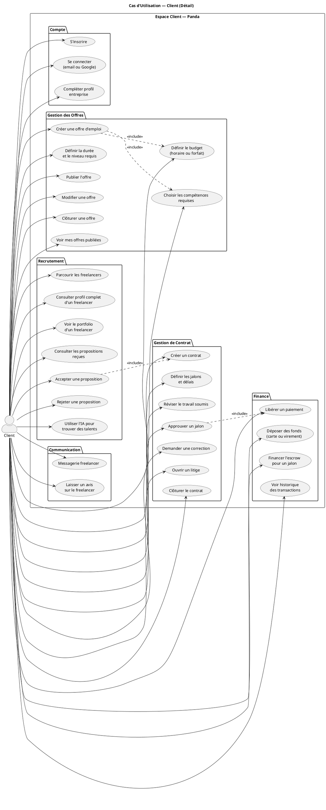

---

## 4. CAS D'UTILISATION — ADMIN (DÉTAIL)

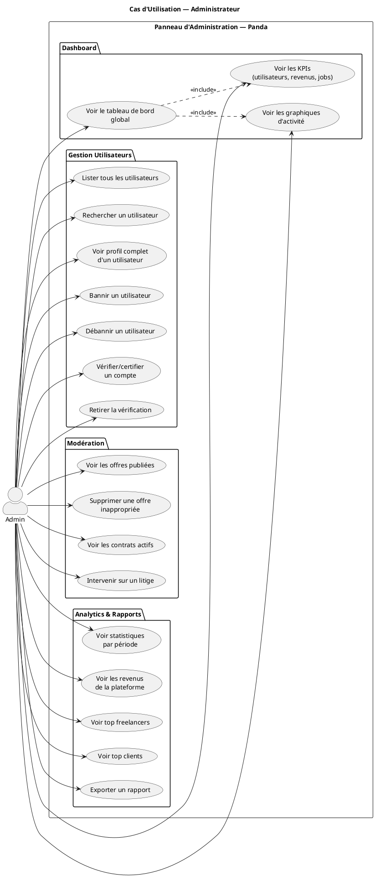

---

## 5. DIAGRAMME DE CLASSES COMPLET

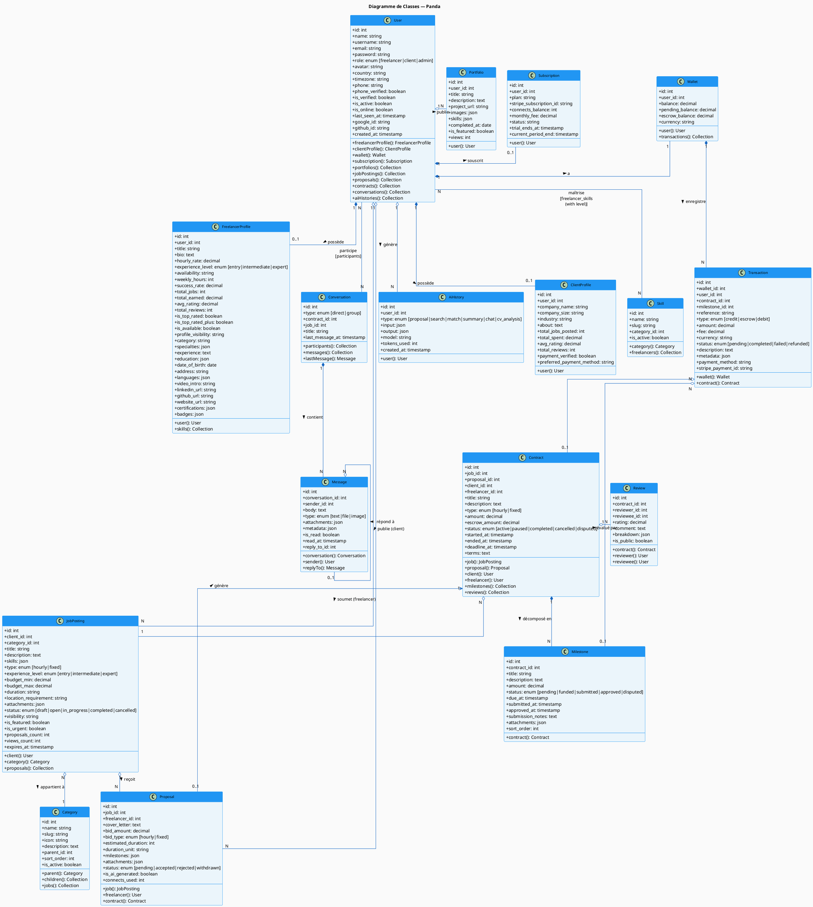

---

## 6. DIAGRAMME ENTITÉ-RELATION (ERD)

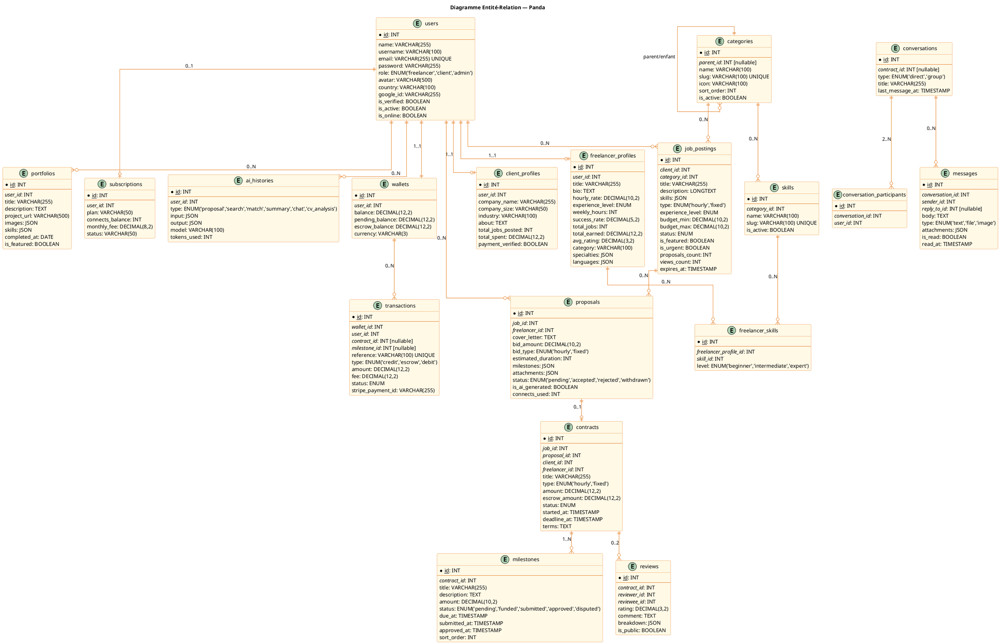

---

## 7. SÉQUENCE — INSCRIPTION ET ONBOARDING FREELANCER

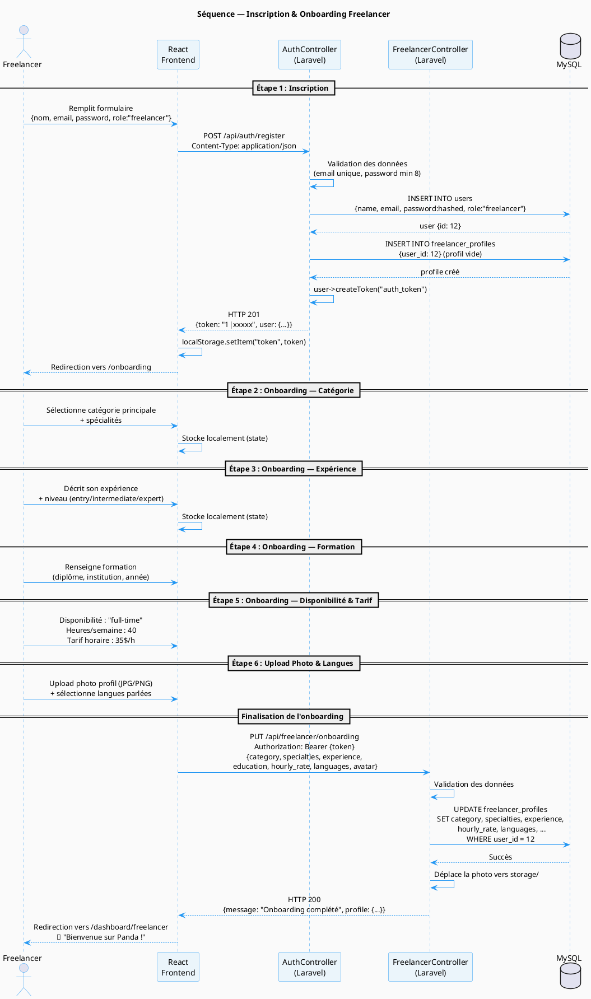

---

## 8. SÉQUENCE — CONNEXION GOOGLE OAUTH

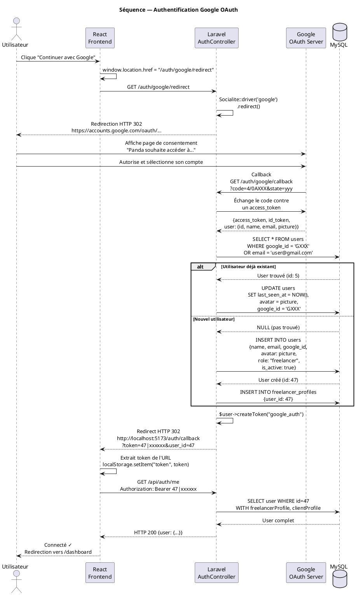

---

## 9. SÉQUENCE — PUBLICATION D'OFFRE ET SOUMISSION DE PROPOSITION

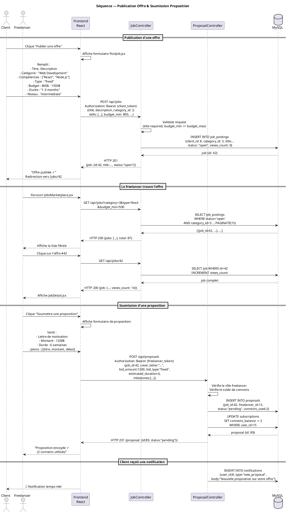

---

## 10. SÉQUENCE — ACCEPTATION DE PROPOSITION ET CRÉATION DE CONTRAT

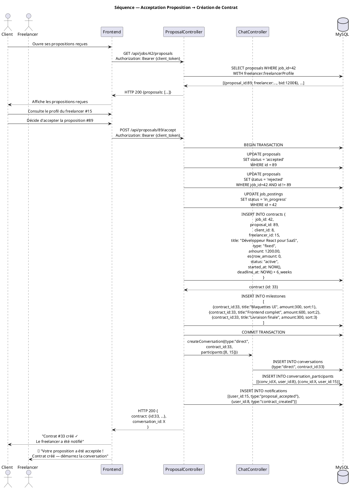

---

## 11. SÉQUENCE — PAIEMENT ESCROW COMPLET

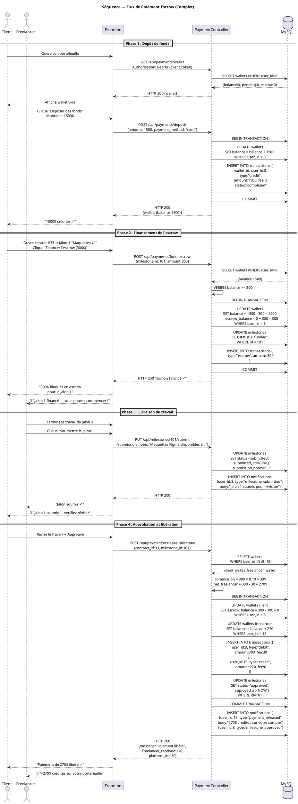

---

## 12. SÉQUENCE — GÉNÉRATION DE PROPOSITION PAR IA

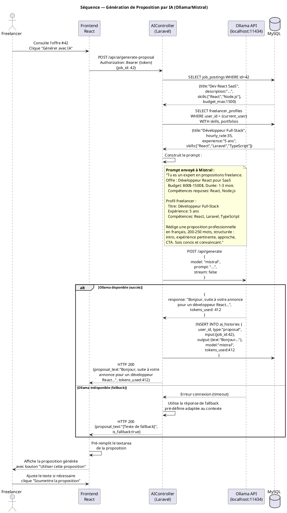

---

## 13. SÉQUENCE — MESSAGERIE TEMPS RÉEL

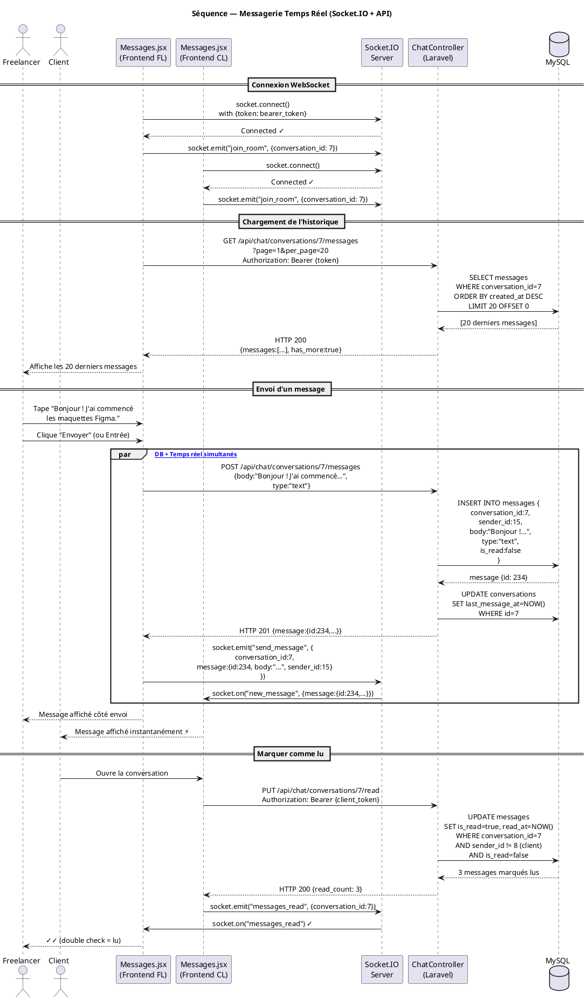

---

## 14. DIAGRAMME D'ACTIVITÉ — CYCLE DE VIE COMPLET D'UNE MISSION

```plantuml
@startuml ACT14_CycleVieMission
skinparam backgroundColor #FAFAFA
skinparam activity {
  BackgroundColor #EBF5FB
  BorderColor #2196F3
  ArrowColor #1565C0
  StartColor #2196F3
  EndColor #1565C0
}
title Diagramme d'Activité — Cycle de Vie d'une Mission Panda

|#LightBlue|Client|
|#LightGreen|Freelancer|
|#FFF9C4|Système|

|Client|
start

:Inscription / Connexion;
:Complète profil entreprise;
:Publie une offre d'emploi\n(titre, budget, compétences, délai);

|Système|
:Offre publiée → statut "open";
:Notification aux freelancers\nde la catégorie;

|Freelancer|
:Parcourt les offres;
if (Offre intéressante ?) then (Oui)
  :Consulte les détails de l'offre;
  if (Utilise l'IA ?) then (Oui)
    :Génère une proposition\nvia Ollama/Mistral;
  else (Non)
    :Rédige manuellement;
  endif
  :Définit montant et jalons;
  :Soumet la proposition\n(-2 connects);
else (Non)
  :Continue à parcourir;
  stop
endif

|Système|
:Proposition créée → statut "pending";
:Notifie le client;

|Client|
:Reçoit et examine les propositions;
if (Satisfait d'une proposition ?) then (Oui)
  :Accepte la proposition;
else (Non)
  :Rejette la ou les propositions;
  |Freelancer|
  :Notification de rejet;
  stop
endif

|Système|
:Contrat créé automatiquement;
:Autres propositions → rejetées;
:Offre → statut "in_progress";
:Conversation créée entre les deux;

|Client|
:Dépose des fonds dans le portefeuille;
:Finance l'escrow du premier jalon;

|Système|
:Milestone → statut "funded";
:Notifie le freelancer;

|Freelancer|
:Commence le travail;
repeat
  :Travaille sur le jalon;
  :Soumet le jalon terminé\n(notes + livrables);
  |Système|
  :Milestone → statut "submitted";
  :Notifie le client;
  |Client|
  :Révise le travail livré;
  if (Approuve ?) then (Oui)
    :Libère le paiement;
    |Système|
    :Déduit 10% de commission;
    :Crédite 90% au freelancer;
    :Milestone → statut "approved";
  else (Correction demandée)
    :Demande des modifications;
    |Freelancer|
    :Effectue les corrections;
  endif
repeat while (Jalons restants ?) is (Oui)
→ (Non)

|Système|
:Contrat → statut "completed";

|Client|
:Évalue le freelancer (⭐1-5);

|Freelancer|
:Évalue le client (⭐1-5);

|Système|
:Mise à jour des statistiques profil;
:avg_rating, total_jobs, total_earned;

stop

@enduml
```

---

## 15. DIAGRAMME D'ACTIVITÉ — FLUX DE PAIEMENT ESCROW

```plantuml
@startuml ACT15_FluxEscrow
title Diagramme d'Activité — Flux de Paiement Escrow
skinparam activity {
  BackgroundColor #FFF9E6
  BorderColor #E67E22
  ArrowColor #D35400
}

|#AED6F1|Client|
|#A9DFBF|Freelancer|
|#FAD7A0|Système|

|Client|
start

:Accède à son portefeuille;
:Dépose des fonds\n(carte bancaire / virement);

|Système|
:wallet.balance += montant_dépôt;
:Transaction de type "credit"\nenregistrée;

|Client|
:Sélectionne un contrat actif;
:Choisit un jalon à financer;
:Clique "Financer l'escrow";

|Système|
if (balance >= montant_jalon ?) then (Oui)
  :wallet.balance -= montant_jalon;
  :wallet.escrow_balance += montant_jalon;
  :milestone.status = "funded";
  :Notification → Freelancer;
else (Solde insuffisant)
  :Affiche erreur "Solde insuffisant";
  |Client|
  :Dépose des fonds supplémentaires;
  backward: Retente;
endif

|Freelancer|
:Reçoit la notification\n"Jalon financé — commencez";
:Réalise le travail;
:Soumet le jalon\n(notes + fichiers livrables);

|Système|
:milestone.status = "submitted";
:Notification → Client;

|Client|
:Révise les livrables;

if (Approuve ?) then (Oui — travail satisfaisant)
  :Clique "Libérer le paiement";
  |Système|
  :commission = montant × 10%;
  :net_freelancer = montant × 90%;
  :client_wallet.escrow_balance -= montant;
  :freelancer_wallet.balance += net;
  :milestone.status = "approved";
  :2 transactions enregistrées;
  :Notifications envoyées;
  |Freelancer|
  :Reçoit les gains (90%);
else if (Demande corrections) then (Oui)
  :Envoie un message\navec les modifications demandées;
  |Freelancer|
  :Réalise les corrections;
  backward: Resoumet;
else (Litige)
  |Client|
  :Ouvre un litige;
  |Système|
  :contract.status = "disputed";
  :Alerte admin plateforme;
  :Admin arbitre manuellement;
  stop
endif

if (Autres jalons ?) then (Oui)
  |Client|
  backward: Finance le prochain jalon;
else (Non — tous les jalons terminés)
  |Système|
  :contract.status = "completed";
  stop
endif

@enduml
```

---

## 16. DIAGRAMME D'ÉTAT — OFFRE D'EMPLOI (JobPosting)

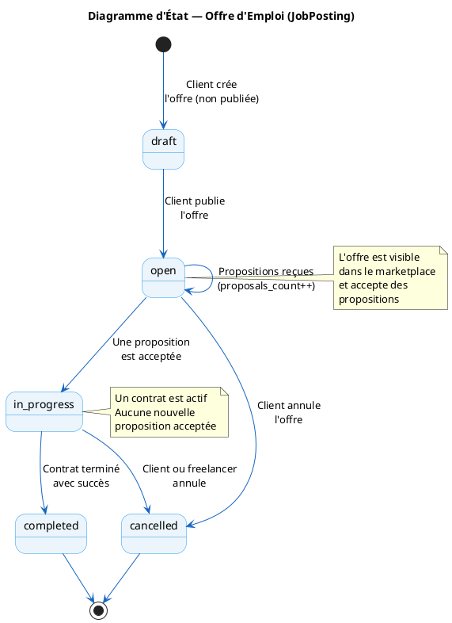

---

## 17. DIAGRAMME D'ÉTAT — PROPOSITION

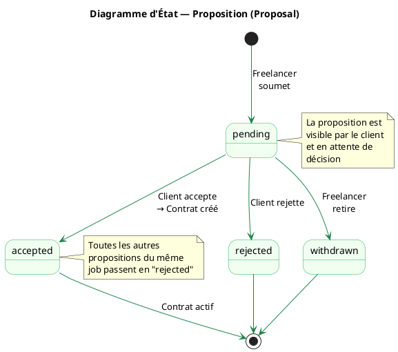

---

## 18. DIAGRAMME D'ÉTAT — CONTRAT

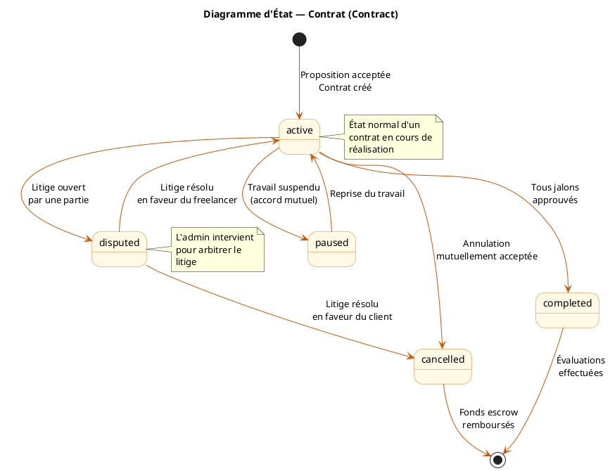

---

## 19. DIAGRAMME D'ÉTAT — JALON (Milestone)

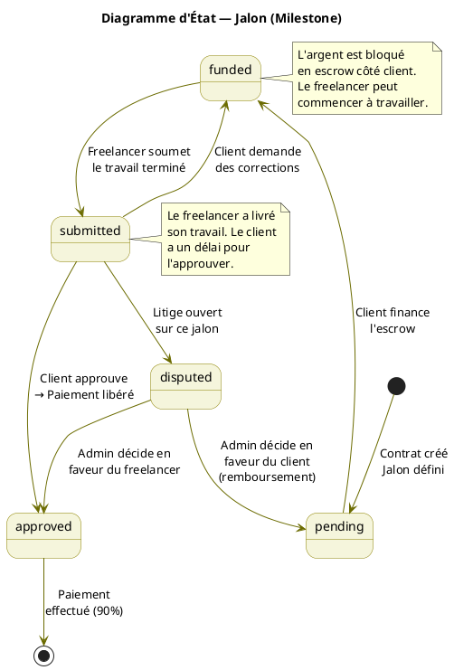

---

## 20. DIAGRAMME DE DÉPLOIEMENT

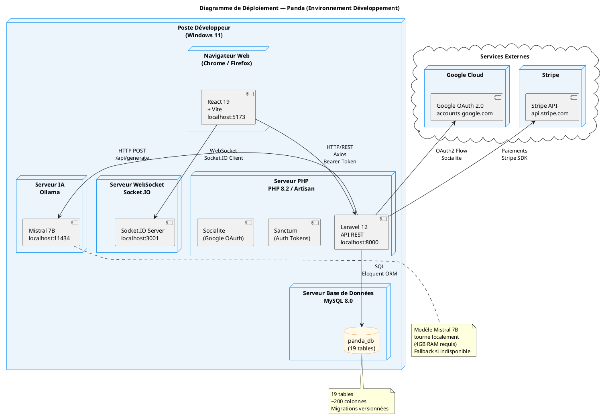

---

## 21. DIAGRAMME DE COMPOSANTS

```plantuml
@startuml COMP21_Components
skinparam component {
  BackgroundColor #EBF5FB
  BorderColor #2196F3
  ArrowColor #1565C0
}
title Diagramme de Composants — Panda

package "Frontend React" {
  package "Pages" {
    [Landing.jsx] as LANDING
    [Login.jsx / Register.jsx] as AUTH_PAGES
    [Onboarding.jsx] as ONBOARD_PAGE
    [JobsMarketplace.jsx] as JOBS_PAGE
    [JobDetail.jsx] as JOB_DETAIL
    [FreelancerDashboard.jsx] as FL_DASH
    [ClientDashboard.jsx] as CL_DASH
    [AdminDashboard.jsx] as ADM_DASH
    [Messages.jsx] as MSG_PAGE
    [Payments.jsx] as PAY_PAGE
    [AIAssistant.jsx] as AI_PAGE
    [FreelancerProfile.jsx] as PROFILE_PAGE
  }

  package "Composants UI" {
    [GlobalNavbar.jsx] as NAVBAR
    [AuthScene3D.jsx] as SCENE3D
    [NotificationPanel.jsx] as NOTIF
    [NavSearch.jsx] as SEARCH_COMP
    [UserAvatar.jsx] as AVATAR
    [PandaLogo.jsx] as LOGO
  }

  package "State Management" {
    [Zustand Store\n(auth, jobs, chat)] as STORE
    [AuthContext.jsx] as AUTH_CTX
  }

  package "API Layer" {
    [Axios Instance\n(baseURL + interceptors)] as AXIOS
  }
}

package "Backend Laravel" {
  package "Controllers" {
    [AuthController] as AUTH_CTRL
    [JobController] as JOB_CTRL
    [ProposalController] as PROP_CTRL
    [FreelancerController] as FL_CTRL
    [ChatController] as CHAT_CTRL
    [PaymentController] as PAY_CTRL
    [AIController] as AI_CTRL
    [ReviewController] as REV_CTRL
    [AdminController] as ADM_CTRL
    [NotificationController] as NOTIF_CTRL
  }

  package "Middleware" {
    [auth:sanctum] as SANCTUM_MID
    [role:freelancer] as ROLE_FL
    [role:client] as ROLE_CL
    [role:admin] as ROLE_ADM
  }

  package "Models Eloquent" {
    [User] as U_MODEL
    [JobPosting] as JP_MODEL
    [Proposal] as PROP_MODEL
    [Contract + Milestone] as CONTRACT_MODEL
    [Wallet + Transaction] as WALLET_MODEL
    [Conversation + Message] as MSG_MODEL
  }
}

package "Externe" {
  [MySQL 8.0] as MYSQL
  [Ollama / Mistral] as OLLAMA_EXT
  [Google OAuth] as GOOGLE_EXT
  [Socket.IO] as SOCKET_EXT
}

' Connexions Frontend → Backend
AXIOS --> AUTH_CTRL
AXIOS --> JOB_CTRL
AXIOS --> PROP_CTRL
AXIOS --> FL_CTRL
AXIOS --> CHAT_CTRL
AXIOS --> PAY_CTRL
AXIOS --> AI_CTRL
AXIOS --> NOTIF_CTRL

' Connexions Pages → Composants
AUTH_PAGES --> SCENE3D
JOBS_PAGE --> NAVBAR
JOBS_PAGE --> SEARCH_COMP
FL_DASH --> NAVBAR
FL_DASH --> NOTIF

' Connexions State
AUTH_PAGES --> AUTH_CTX
AUTH_CTX --> AXIOS
STORE --> AXIOS

' Middleware
AUTH_CTRL --> SANCTUM_MID
JOB_CTRL --> SANCTUM_MID
FL_CTRL --> ROLE_FL
PAY_CTRL --> ROLE_CL
ADM_CTRL --> ROLE_ADM

' Models → DB
U_MODEL --> MYSQL
JP_MODEL --> MYSQL
CONTRACT_MODEL --> MYSQL
WALLET_MODEL --> MYSQL
MSG_MODEL --> MYSQL

' External
AI_CTRL --> OLLAMA_EXT
AUTH_CTRL --> GOOGLE_EXT
MSG_PAGE --> SOCKET_EXT

@enduml
```

---

## RÉCAPITULATIF FINAL

| # | Diagramme | Couverture |
|---|-----------|-----------|
| 1 | Use Case Global | Tous acteurs, tous modules |
| 2 | Use Case Freelancer | Détail complet des fonctions |
| 3 | Use Case Client | Détail complet des fonctions |
| 4 | Use Case Admin | Gestion plateforme |
| 5 | Diagramme de Classes | 17 classes, toutes relations |
| 6 | ERD | 19 tables SQL avec types |
| 7 | Séquence Inscription+Onboarding | Flux complet 6 étapes |
| 8 | Séquence OAuth Google | Flux Socialite complet |
| 9 | Séquence Job+Proposition | Publication et soumission |
| 10 | Séquence Acceptation+Contrat | Création auto du contrat |
| 11 | Séquence Escrow | 4 phases de paiement |
| 12 | Séquence IA | Génération proposition Ollama |
| 13 | Séquence Messagerie | Socket.IO + persistance |
| 14 | Activité Cycle de vie | Mission de A à Z |
| 15 | Activité Escrow | Flux paiement détaillé |
| 16 | État JobPosting | 5 états de l'offre |
| 17 | État Proposal | 4 états de la proposition |
| 18 | État Contract | 5 états du contrat |
| 19 | État Milestone | 6 états du jalon |
| 20 | Déploiement | Architecture serveurs |
| 21 | Composants | Architecture logicielle |

---

> **Rendu en ligne :** [plantuml.com/plantuml](https://www.plantuml.com/plantuml/uml/)
> **Extension VS Code :** `jebbs.plantuml` → Ctrl+Shift+P → "Preview Current Diagram"
